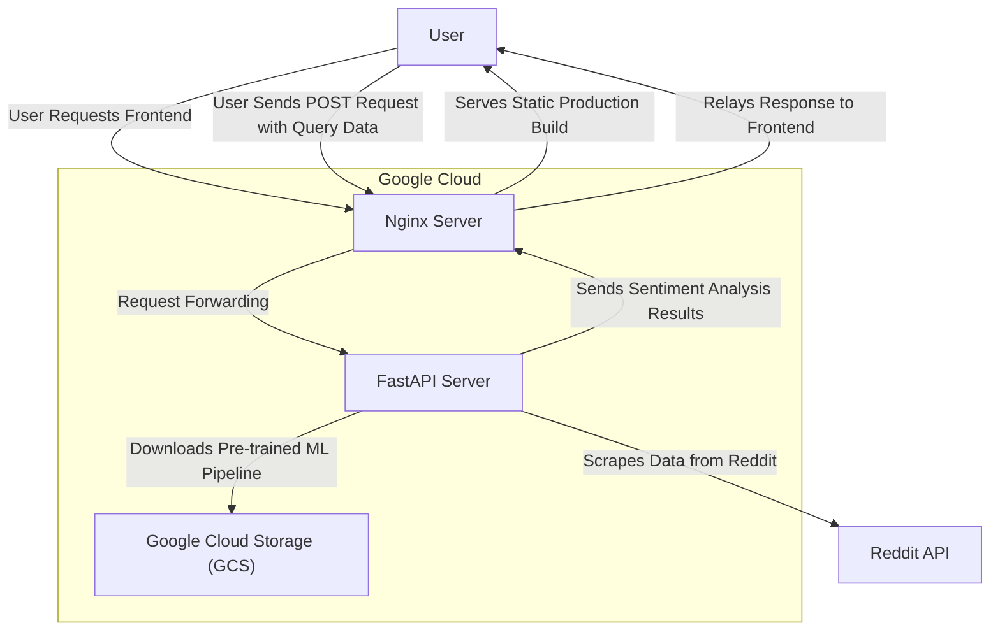

# Topic Sentiment Analyzer Server


## Description

This server analyzes social media sentiment for a given text by scraping Reddit comments and running sentiment analysis using a machine learning pipeline.

Features include:

- Jupyter notebook with the ML workflow (data prep, model training, etc.)
- FastAPI for scraping Reddit API and running sentiment analysis

Technologies used:

- Python
- Scikit-learn
- MLflow
- Google Cloud Storage
- FastAPI
- Pytest
- Docker

The frontend server's source code can be found in the [topic-sentiment-analyzer-client](https://github.com/leinadest/topic-sentiment-analyzer-client) repository.

## ML Pipeline

Traditional sentiment analysis using Term Frequency-Inverse Document Frequency (TF-IDF) vectorization followed by a Support Vector Machine (SVM) classifier. Training was done on 58k Reddit comments from the GoEmotions dataset. The pipeline can be recreated by following notebook installation instructions and then running the `/notebooks/ml_workflow.ipynb` notebook.

The pipeline's performance is as follows:

|              | Score    | Support |
|--------------|----------|---------|
| Accuracy     | 0.59     | 11027   |

| Emotion   | Precision | Recall | F1-Score | Support |
|-----------|-----------|--------|----------|---------|
| Happy     | 0.71      | 0.72   | 0.72     | 3054    |
| Sad       | 0.25      | 0.50   | 0.34     | 680     |
| Angry     | 0.41      | 0.44   | 0.43     | 1764    |
| Scared    | 0.24      | 0.43   | 0.31     | 190     |
| Neutral   | 0.73      | 0.59   | 0.65     | 5339    |

| Average      | Precision | Recall | F1-Score | Support |
|--------------|-----------|--------|----------|---------|
| Macro Avg    | 0.47      | 0.54   | 0.49     | 11027   |
| Weighted Avg | 0.63      | 0.59   | 0.61     | 11027   |

## Notebook Installation

1. Clone the repository:

   ```bash
   git clone https://github.com/leinadest/topic-sentiment-analyzer-server.git
   ```

2. Install notebook dependencies:

   ```bash
   make setup
   make notebook_setup
   ```

3. Env file:

   ```bash
   # .env

   # Notebook mlflow
   TRACKING_URI=https://example-tracking-server.us-central1.run.app
   ```

## Data Flow



1. **User Requests Frontend**: The user accesses the frontend via a Nginx cloud run server, which serves a static production build of the frontend.

2. **User Sends Data**: The user submits a POST request with query data to the Nginx server.

3. **Request Forwarding**: The Nginx server acts as a reverse proxy, forwarding the request to the backend FastAPI cloud run server (this repository) for processing.

4. **Backend Processing**: The FastAPI server performs several tasks:

   1. Downloads a pre-trained machine learning pipeline from Google Cloud Storage (GCS).
   2. Scrapes data from Reddit using the asyncpraw library.
   3. Runs the pipeline's sentiment analysis on the scraped data.

5. **Response to User**: The FastAPI server sends the inference results back to the client Nginx server, which then relays the response to the user's frontend.

## Development Installation

1. Clone the repository:

   ```bash
   git clone https://github.com/leinadest/topic-sentiment-analyzer-server.git
   ```

2. Install dependencies:

   ```bash
   cd topic-sentiment-analyzer-server
   make setup
   ```

3. Env file:

   ```bash
   # .env

   # GCS
   GOOGLE_APPLICATION_CREDENTIALS=secrets/example-storage-object-viewer-key.json
   BUCKET_NAME=example-mlflow-artifacts-store
   MODEL_PATH=example-pipeline.tar.gz

   # Reddit
   REDDIT_CLIENT_ID=example-client-id
   REDDIT_CLIENT_SECRET=example-client-secret
   REDDIT_USER_AGENT=example-user-agent

   # Client
   CLIENT_ORIGIN=http://localhost:5173
   ```

## Usage

1. Run the developmental server:

   ```bash
   cd topic-sentiment-analyzer-server
   make dev
   ```

2. Access the server's development interface at http://localhost:8000/docs.

3. Run quality checks:

   ```bash
   make quality_checks
   ```

4. Run tests:

   ```bash
   make test
   ```

## Deployment

The project is deployed on Google Cloud Run and is accessible at the following link:

[Live Demo](https://topic-sentiment-analyzer-client-148621174923.us-central1.run.app/)
